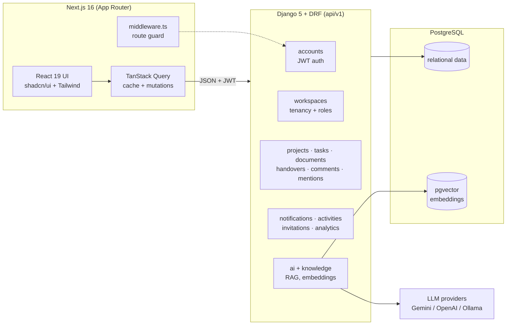

# Nexora — AI Knowledge & Workflow Assistant

A full-stack, multi-tenant team workspace: projects, tasks, documents, formal
task handovers with manager review, comments & mentions, notifications, an
audit log, workspace analytics, and an AI assistant (RAG over your workspace
knowledge) — built with **Django REST Framework** and **Next.js**.

## Feature highlights

- **Workspaces (multi-tenancy)** — every object hangs off a workspace; membership
  is role-based (owner / admin / manager / member) with invitations by email.
- **Projects, tasks, documents** — full CRUD with search, filters, sorting,
  pagination, labels, priorities, and due-date tracking.
- **Task handovers** — a member formally hands a task to a teammate with a work
  summary, pending items, and resources; a manager approves (task is reassigned)
  or rejects with a comment. Every handover is exportable as a **PDF**.
- **Analytics** — dependency-free SVG charts: weekly created-vs-completed,
  status/priority breakdowns, per-member workload, handover review metrics
  (colors validated for color-vision deficiency in light *and* dark mode).
- **Audit log** — an append-only activity trail with action / member / date
  filters and one-click **CSV export**.
- **Collaboration** — threaded comments with @mentions, in-app notifications,
  and a live activity feed on every detail page.
- **AI assistant (RAG)** — semantic search and chat over workspace documents
  using pgvector embeddings; pluggable providers (Gemini / OpenAI / Ollama).
- **Auth** — email-based JWT auth with transparent refresh, route protection in
  Next.js middleware, and workspace-scoped permissions on every endpoint.

## Screenshots

| Dashboard | Analytics |
|---|---|
|  |  |

| Handover review | Audit log |
|---|---|
|  |  |

> Screenshots live in `docs/screenshots/`. To refresh them, run the app
> (see Quickstart) and capture the pages above at 1440×900.

## Architecture



**Backend layering.** Each domain is a Django app under `backend/apps/`. Shared
building blocks live in `apps/common`: UUID+timestamp base models, an
audit-trail mixin (`created_by`/`updated_by`), a `WorkspaceScopedModel` tenant
base, workspace-role permission classes, and a `WorkspaceScopedViewSet` that
scopes every queryset to the requesting user's workspaces. Cross-cutting
concerns are decoupled through signals and small service functions:
`activities` records the audit trail via `post_save`/`post_delete` handlers,
and `notifications` exposes `create_notification()` used by domain apps.

**Frontend layering.** `src/lib/api/*` is a typed fetch layer (JWT injection,
single-flight token refresh, error normalisation) → `src/hooks/*` wraps it in
TanStack Query → pages under `src/app/(app)/*` compose shadcn/ui components.
Zod schemas in `src/lib/validations/*` mirror backend constraints.

## Tech stack

| Layer | Choices |
|---|---|
| Frontend | Next.js 16 (App Router), React 19, TypeScript, Tailwind CSS 4, shadcn/ui, TanStack Query 5, react-hook-form + zod |
| Backend | Django 5.1, Django REST Framework, SimpleJWT, django-filter, drf-spectacular (OpenAPI) |
| Database | PostgreSQL + pgvector |
| AI | sentence-transformers embeddings, Gemini / OpenAI / Ollama chat providers |
| Exports | reportlab (handover PDF), CSV audit-log export |

## Repository layout

```
nexora/
├── backend/
│   ├── apps/
│   │   ├── common/          # base models, permissions, scoped viewset
│   │   ├── accounts/        # email-based user + JWT auth
│   │   ├── workspaces/      # tenancy, members, roles
│   │   ├── projects/ tasks/ documents/
│   │   ├── handovers/       # handover workflow + PDF export
│   │   ├── comments/ mentions/ notifications/ activities/ invitations/
│   │   ├── knowledge/ ai/   # embeddings, RAG, providers
│   │   └── core/            # health, dashboard, analytics
│   └── config/              # settings (base/dev/prod), urls, asgi/wsgi
└── frontend/
    └── src/
        ├── app/(auth)/      # login, register
        ├── app/(app)/       # dashboard, analytics, projects, tasks,
        │                    # handovers, documents, activity, ai, …
        ├── components/      # ui/ (shadcn), charts/, domain components
        ├── hooks/ lib/ providers/ types/
        └── middleware.ts    # cookie-based route guard
```

## Quickstart

Prerequisites: Python 3.13+, Node 20+, PostgreSQL 16+ with the pgvector
extension (`CREATE EXTENSION vector;`).

### Backend

```bash
cd backend
python -m venv .venv && . .venv/Scripts/activate   # or bin/activate on Unix
pip install -r requirements.txt
cp .env.example .env          # then set DATABASE_URL + SECRET_KEY
python manage.py migrate
python manage.py runserver    # http://localhost:8000
```

API docs (OpenAPI): `http://localhost:8000/api/docs/` (Swagger) and `/api/redoc/`.

### Frontend

```bash
cd frontend
npm install
cp .env.example .env.local    # NEXT_PUBLIC_API_URL=http://localhost:8000/api/v1
npm run dev                   # http://localhost:3000
```

### Tests

```bash
cd backend
python manage.py test         # handover workflow API tests live in apps/handovers/tests.py
```

## API surface (v1)

| Area | Endpoints |
|---|---|
| Auth | `POST /auth/register` · `/auth/login` · `/auth/refresh` · `GET /auth/me` |
| Workspaces | `/workspaces/` CRUD · members · `transfer-ownership` |
| Projects / Tasks / Documents | scoped CRUD with search, filters, ordering |
| Handovers | CRUD · `POST /handovers/{id}/review/` · `GET /handovers/{id}/export/` (PDF) |
| Dashboard / Analytics | `GET /dashboard/` · `GET /analytics/` |
| Audit log | `GET /activities/` · `GET /activities/export/` (CSV) |
| Collaboration | `/comments/` · `/mentions/` · `/notifications/` · `/invitations/` |
| AI | `/ai/chat/` · `/ai/search/` · `/ai/summarize/` · conversations, templates, settings |

## Roles & permissions

| Role | Capabilities |
|---|---|
| Owner | Everything, including ownership transfer and workspace deletion |
| Admin | Manage members/invitations, all content, review handovers |
| Manager | Member capabilities **plus** handover review (approve / reject) |
| Member | Create and edit content, submit handovers, collaborate |

## Delivery phases

| Phase | Scope |
|---|---|
| 1 | Project setup, tenancy foundations |
| 2 | Auth (JWT), accounts |
| 3 | Projects, tasks, documents CRUD |
| 4 | Collaboration: comments, mentions, notifications, activity, invitations |
| 5 | AI knowledge assistant (RAG) · Core workflow: handovers + manager review |
| 6 | Polish: filters, global search, dashboard, validation, loading/empty states |
| 7 | Interview value: analytics, PDF export, audit log, this README |
