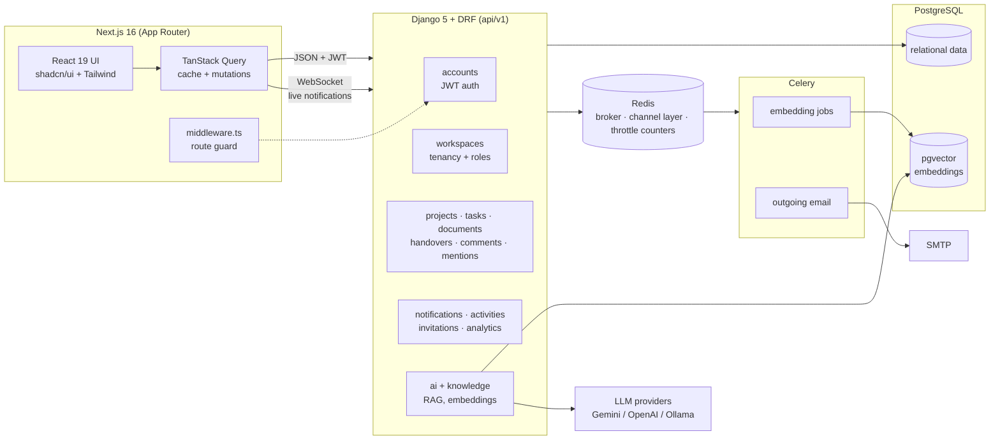

# Nexora — AI Knowledge & Workflow Assistant

A full-stack, multi-tenant team workspace: projects, tasks, documents, formal
task handovers with manager review, comments & mentions, notifications, an
audit log, workspace analytics, and an AI assistant (RAG over your workspace
knowledge) — built with **Django REST Framework** and **Next.js**.

## Feature highlights

- **Workspaces (multi-tenancy)** — every object hangs off a workspace; membership
  is role-based (owner / admin / manager / member) with invitations by email.
- **Projects, tasks, documents** — full CRUD with search, filters, sorting,
  pagination, labels, priorities, and due-date tracking.
- **Task handovers** — a member formally hands a task to a teammate with a work
  summary, pending items, and resources; a manager approves (task is reassigned)
  or rejects with a comment. Every handover is exportable as a **PDF**.
- **Analytics** — dependency-free SVG charts: weekly created-vs-completed,
  status/priority breakdowns, per-member workload, handover review metrics
  (colors validated for color-vision deficiency in light *and* dark mode).
- **Audit log** — an append-only activity trail with action / member / date
  filters and one-click **CSV export**.
- **Collaboration** — threaded comments with @mentions, notifications pushed
  live over WebSockets, and an activity feed on every detail page.
- **AI assistant (RAG)** — semantic search and chat over workspace documents
  using pgvector embeddings; pluggable providers (Gemini / OpenAI / Ollama).
- **Auth** — email-based JWT auth with transparent refresh, self-service
  password reset by email, route protection in Next.js middleware, rate-limited
  credential endpoints, and workspace-scoped permissions on every endpoint.

## Screenshots

| Dashboard | Analytics |
|---|---|
|  |  |

| Handover review | Audit log |
|---|---|
|  |  |

> Screenshots live in `docs/screenshots/`. To refresh them, run the app
> (see Quickstart) and capture the pages above at 1440×900.

## Architecture



**Backend layering.** Each domain is a Django app under `backend/apps/`. Shared
building blocks live in `apps/common`: UUID+timestamp base models, an
audit-trail mixin (`created_by`/`updated_by`), a `WorkspaceScopedModel` tenant
base, workspace-role permission classes, and a `WorkspaceScopedViewSet` that
scopes every queryset to the requesting user's workspaces. Cross-cutting
concerns are decoupled through signals and small service functions:
`activities` records the audit trail via `post_save`/`post_delete` handlers,
and `notifications` exposes `create_notification()` used by domain apps.

**Frontend layering.** `src/lib/api/*` is a typed fetch layer (JWT injection,
single-flight token refresh, error normalisation) → `src/hooks/*` wraps it in
TanStack Query → pages under `src/app/(app)/*` compose shadcn/ui components.
Zod schemas in `src/lib/validations/*` mirror backend constraints.

## Tech stack

| Layer | Choices |
|---|---|
| Frontend | Next.js 16 (App Router), React 19, TypeScript, Tailwind CSS 4, shadcn/ui, TanStack Query 5, react-hook-form + zod |
| Backend | Django 5.1, Django REST Framework, SimpleJWT, django-filter, drf-spectacular (OpenAPI) |
| Database | PostgreSQL + pgvector |
| Realtime | Django Channels (WebSockets) over Redis, with polling fallback |
| Background jobs | Celery + Redis (document embedding, outgoing email) |
| AI | sentence-transformers embeddings, Gemini / OpenAI / Ollama chat providers |
| Exports | reportlab (handover PDF), CSV audit-log export |
| Tests | Django test runner (backend), Vitest + Testing Library (frontend) |
| Deployment | Docker + docker compose, GitHub Actions CI |

## Repository layout

```
nexora/
├── backend/
│   ├── apps/
│   │   ├── common/          # base models, permissions, scoped viewset
│   │   ├── accounts/        # email-based user + JWT auth
│   │   ├── workspaces/      # tenancy, members, roles
│   │   ├── projects/ tasks/ documents/
│   │   ├── handovers/       # handover workflow + PDF export
│   │   ├── comments/ mentions/ notifications/ activities/ invitations/
│   │   ├── knowledge/ ai/   # embeddings, RAG, providers
│   │   └── core/            # health, dashboard, analytics
│   ├── config/              # settings (base/dev/prod/test), urls, asgi, celery
│   ├── templates/email/     # invitation + password-reset bodies
│   └── Dockerfile
├── docker-compose.yml       # db · redis · web · worker · frontend
├── .github/workflows/ci.yml
└── frontend/
    └── src/
        ├── app/(auth)/      # login, register, forgot/reset password
        ├── app/(app)/       # dashboard, analytics, projects, tasks,
        │                    # handovers, documents, activity, ai, …
        ├── components/      # ui/ (shadcn), charts/, domain components
        ├── hooks/ lib/ providers/ types/
        └── middleware.ts    # cookie-based route guard
```

## Quickstart

### With Docker (everything, one command)

```bash
cp .env.docker.example .env    # then set SECRET_KEY
docker compose up --build
```

Brings up PostgreSQL (with pgvector), Redis, the API, a Celery worker and the
frontend; migrations run on start. API at `http://localhost:8000/api/v1`,
frontend at `http://localhost:3000`. Emails print to the `web` container log
unless SMTP is configured.

### Without Docker

Prerequisites: Python 3.13+, Node 20+, PostgreSQL 16+ with the pgvector
extension (`CREATE EXTENSION vector;`).

Redis is **optional locally**. Without it, throttle counters live in local
memory, websockets use an in-process channel layer, and Celery tasks run inline
— so the app is fully usable with just PostgreSQL. All three need a real Redis
as soon as more than one process is serving traffic.

### Backend

```bash
cd backend
python -m venv .venv && . .venv/Scripts/activate   # or bin/activate on Unix
pip install -r requirements.txt
cp .env.example .env          # then set DATABASE_URL + SECRET_KEY
python manage.py migrate
python manage.py runserver    # http://localhost:8000
```

`runserver` is Channels' ASGI version (daphne), so websockets work in
development without any extra process.

API docs (OpenAPI): `http://localhost:8000/api/docs/` (Swagger) and `/api/redoc/`.

#### Background worker (optional locally)

Document embedding and outgoing email run inline in development. To process
them out of band, point the app at Redis and start a worker:

```bash
# in backend/.env
REDIS_URL=redis://localhost:6379/0
CELERY_TASK_ALWAYS_EAGER=False
```

```bash
celery -A config worker --loglevel=info
```

### Demo data

```bash
cd backend
python manage.py seed_demo --owner-email you@example.com   # your login owns the data
python manage.py seed_demo --reset --owner-email you@example.com   # re-seed from scratch
```

Creates three workspaces (*Aurora Labs*, *Northwind Ops*, *Client Portal*) with
eleven teammates, twelve projects, ~60 tasks, documents with real embedded
content, handovers in every review state, threaded comments with @mentions,
notifications, invitations, an eight-week activity trail and AI conversations,
prompt templates and search history. Enum-backed fields are covered
exhaustively — every task status × priority pair, every project/handover/
invitation state — so filters and charts all have data. Timestamps are
backdated across eight weeks so the analytics series, overdue counters and
audit-log date filters are meaningful.

`--reset` only removes the seeded workspaces and the `@nexora.demo` accounts;
real accounts and their data are untouched. Add `--skip-embedding` to skip the
(slow) local embedding pass — AI semantic search then returns nothing. Seeded
accounts share the password `Demo@12345`.

### Frontend

```bash
cd frontend
pnpm install                  # the lockfile is pnpm's; npm/yarn will not match it
cp .env.example .env.local    # NEXT_PUBLIC_API_URL=http://localhost:8000/api/v1
pnpm dev                      # http://localhost:3000
```

### Tests

```bash
cd backend
python manage.py test         # 89 tests

cd ../frontend
pnpm typecheck                # tsc --noEmit
pnpm lint                     # eslint
pnpm test                     # vitest
pnpm build                    # production build
```

`manage.py test` selects `config.settings.test` automatically: no Redis, no
broker and no SMTP are required, and rate limiting is off so a test that walks
40 endpoints is not mistaken for an attack.

Backend coverage:

| Module | Covers |
|---|---|
| `apps/core/tests_smoke.py` | end-to-end walk across every API area, tenancy isolation, anonymous access |
| `apps/workspaces/tests.py` | the role matrix — who may administer, transfer and delete |
| `apps/accounts/tests.py` | password reset (reuse, tampering, enumeration, session revocation) and credential rate limits |
| `apps/handovers/tests.py` | the handover review workflow |
| `apps/notifications/tests.py` | websocket auth, per-user isolation, realtime push |
| `apps/invitations/tests.py` | invitation email delivery and the accept/reject lifecycle |
| `apps/knowledge/tests.py` | embedding scheduling, retries and failure recording |
| `apps/activities/tests.py` | the audit trail, including cascade deletes |
| `apps/core/tests_seed_demo.py` | the demo seeder: idempotency, determinism, scoped reset |

Frontend tests run under Vitest with Testing Library
(`src/**/*.test.{ts,tsx}`).

### Continuous integration

`.github/workflows/ci.yml` runs the backend suite against PostgreSQL+pgvector
and Redis, then typechecks, lints, tests and builds the frontend. Pushes to
`main`/`develop` additionally build both Docker images.

## API surface (v1)

| Area | Endpoints |
|---|---|
| Auth | `POST /auth/register` · `/auth/login` · `/auth/refresh` · `/auth/logout` · `GET`/`PATCH /auth/me` |
| Password reset | `POST /auth/password-reset/` · `POST /auth/password-reset/confirm/` |
| Workspaces | `/workspaces/` CRUD · members · `transfer-ownership` |
| Projects / Tasks / Documents | scoped CRUD with search, filters, ordering |
| Handovers | CRUD · `POST /handovers/{id}/review/` · `GET /handovers/{id}/export/` (PDF) |
| Dashboard / Analytics | `GET /dashboard/` · `GET /analytics/` |
| Audit log | `GET /activities/` · `GET /activities/export/` (CSV) |
| Collaboration | `/comments/` · `/mentions/` · `/notifications/` · `/invitations/` |
| AI | `/ai/chat/` · `/ai/search/` · `/ai/summarize/` · conversations, templates, settings |
| Realtime | `WS /ws/notifications/?token=<access>` — push-only notification stream |

## Roles & permissions

| Role | Capabilities |
|---|---|
| Owner | Everything, including ownership transfer and workspace deletion |
| Admin | Manage members/invitations, all content, review handovers |
| Manager | Member capabilities **plus** handover review (approve / reject) |
| Member | Create and edit content, submit handovers, collaborate |

## Delivery phases

| Phase | Scope |
|---|---|
| 1 | Project setup, tenancy foundations |
| 2 | Auth (JWT), accounts |
| 3 | Projects, tasks, documents CRUD |
| 4 | Collaboration: comments, mentions, notifications, activity, invitations |
| 5 | AI knowledge assistant (RAG) · Core workflow: handovers + manager review |
| 6 | Polish: filters, global search, dashboard, validation, loading/empty states |
| 7 | Interview value: analytics, PDF export, audit log, this README |
| 8 | Production readiness: transactional email, password reset, rate limiting, background jobs, realtime notifications, test suites, Docker, CI |
